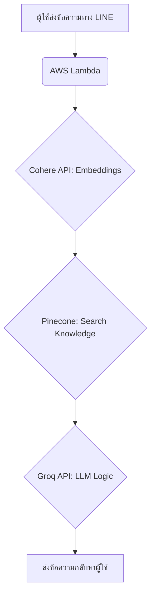

# 🤖 AI LINE Chatbot RAG (AIBeacon Helper)

แชทบอทอัจฉริยะสำหรับให้ข้อมูลผลิตภัณฑ์ **AIBeacon** โดยใช้สถาปัตยกรรม **RAG (Retrieval-Augmented Generation)** ผสานพลังของ LLM ความเร็วสูงและฐานข้อมูล Vector เพื่อการตอบคำถามที่แม่นยำและรวดเร็ว

## 🚀 ภาพรวมการทำงาน (Architecture & Logic)

ระบบนี้ใช้หลักการ **RAG (Retrieval-Augmented Generation)** เพื่อให้บอทตอบคำถามได้ตรงประเด็นและมีข้อมูลอ้างอิงที่ถูกต้อง:

1.  **User Message:** ผู้ใช้ส่งข้อความผ่าน LINE
2.  **Vector Search:** ระบบแปลงคำถามเป็น Vector และค้นหาใน **Pinecone**
3.  **Smart Routing:** 
    *   **Exact Match:** หากคะแนนความเหมือนสูงมาก (>0.95) จะตอบคำถามจากฐานข้อมูลโดยตรงทันที
    *   **AI Generation:** หากคะแนนปานกลาง จะนำข้อมูลที่พบส่งให้ **Groq (Llama-3.1)** เพื่อสรุปคำตอบให้เป็นธรรมชาติ
4.  **Quick Reply Suggestions:** ระบบจะนำคำถามอื่นๆ ที่เกี่ยวข้องจากผลการค้นหามาแสดงเป็นปุ่ม **Quick Reply** เพื่อให้ผู้ใช้เลือกถามต่อได้ง่ายขึ้น
5.  **Response:** ส่งคำตอบกลับพร้อมปุ่มแนะนำคำถามที่เกี่ยวข้อง



## 🛠 Tech Stack

-   **Runtime:** Python 3.12 (AWS Lambda)
-   **LLM Engine:** [Groq](https://groq.com/) (Llama-3.1-8b-instant)
-   **Vector Database:** [Pinecone](https://www.pinecone.io/)
-   **Embeddings:** [Cohere](https://cohere.com/) (Multilingual v3.0)
-   **Interface:** [LINE Messaging API](https://developers.line.biz/en/)

## 📂 โครงสร้างโปรเจกต์

-   `lambda_function.py`: โค้ดหลักที่รันบน AWS Lambda
-   `package/`: โฟลเดอร์เก็บไลบรารีต่างๆ (Dependencies)
-   `build_lambda.py`: สคริปต์อัตโนมัติสำหรับบีบอัดไฟล์ขึ้น Lambda
-   `test_local.py`: สคริปต์สำหรับจำลองการทดสอบในเครื่องคอมพิวเตอร์ (Local)
-   `.env`: ไฟล์เก็บ API Keys (ใช้สำหรับการเทสในเครื่อง)
-   `requirements.txt`: ไฟล์รายการไลบรารีที่จำเป็น

## ⚙️ วิธีการติดตั้งและเริ่มใช้งาน

### 1. เตรียม Environment
สร้างไฟล์ `.env` (หรือใช้ AWS Environment Variables) โดยระบุ Key ดังนี้:
-   `LINE_CHANNEL_SECRET`
-   `LINE_CHANNEL_ACCESS_TOKEN`
-   `PINECONE_API_KEY`
-   `PINECONE_INDEX_NAME`
-   `COHERE_API_KEY`
-   `GROQ_API_KEY`

### 2. ติดตั้ง Dependencies (สำหรับรันบน Lambda)
ต้องติดตั้งไลบรารีให้เป็นเวอร์ชัน Linux เพื่อให้ Lambda รองรับ:
```bash
pip install --target package --platform manylinux2014_x86_64 --only-binary=:all: --implementation cp --python-version 3.12 -r requirements.txt --upgrade
```

### 3. ทดสอบการทำงานในเครื่อง (Local Test)
คุณสามารถรันการทดสอบเพื่อให้มั่นใจว่า API ทุกตัวเชื่อมต่อได้ปกติ:
```bash
python test_local.py
```

### 4. การ Deploy ขึ้น AWS Lambda
ใช้สคริปต์ที่เตรียมไว้เพื่อสร้างไฟล์ Zip:
```bash
python build_lambda.py
```
จากนั้นนำไฟล์ `deployment_package.zip` ไปอัปโหลดบน AWS Lambda Console โดยตั้งค่า Handler เป็น `lambda_function.lambda_handler`

## ✨ จุดเด่นของบอทตัวนี้
-   **Fast Responses:** ใช้ Groq API ทำให้การเจนคำตอบไวกว่าเดิมมาก
-   **Multilingual Support:** รองรับภาษาไทยและภาษาอื่นๆ ได้อย่างแม่นยำด้วย Cohere
-   **Quick Reply Suggestions:** ดึงคำถามที่ใกล้เคียงจาก FAQ มาแสดงเป็นปุ่มเพื่อให้ผู้ใช้เลือกถามต่อได้ทันที (ลดการพิมพ์)
-   **Hybrid Logic:** สลับระหว่างการตอบตรง (Exact Match) และการใช้ AI สรุป (Gen AI) ตามความเหมาะสมของข้อมูล
-   **User Feedback:** มี Loading Animation บอกสถานะการทำงานของบอท

---
พัฒนาโดย Fawas Thongkham
